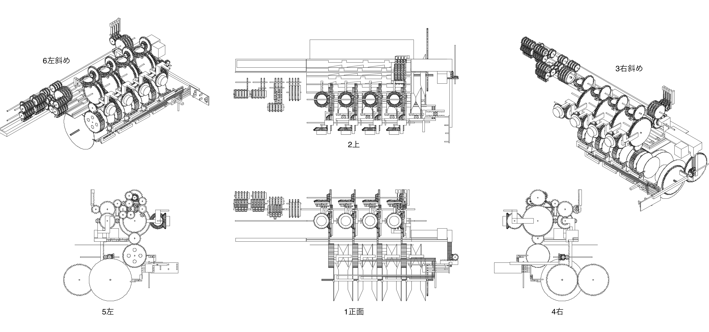

# 機構について

今回作成した機構のパラメータについて記載しています。

単位はFusion内では[mm]となっていますが、実際に[mm]だと非常に小さくなってしまうので、比としてとらえてください

## 目次
- [機構の全体像](#機構の全体像 ワイヤーフレーム)
- [平歯車の設計](#平歯車の設計)
- [すぐばかさ歯車の設計](#すぐばかさ歯車の設計)
- [ラックギアの設計](#ラックギアの設計)
- [プーリーの設計](#プーリーの設計)

 

## 機構の全体像 ワイヤーフレーム

 
[1面正](resources/image/1front.png)
 
[2上](resources/image/2top.png)
 
[3右斜め](resources/image/3rightOblique.png)
 
[4右](resources/image/4right.png)
 
[5下](resources/image/5bottom.png)
 
[6左](resources/image/6left.png)
 
[7左斜め](resources/image/7leftOblique.png)
 

## 平歯車の設計
Fusion360の「ツール」から「アドインとスクリプト」より「SpurGear]を使用した。

パラメータ

| 名前               | 値                |
| :---               | :---:             |
| Pressure Angle     | 20°              |
| Module             | 1                 |
| Number of Teeth    | 任意              |
| Backlash           | 0                 |
| Root Fillet Radius | 0.5               |
| Gear Thicknes      | 任意              |
| Hole Diameter      | 2                 |
| Pich Diameter      | (Number of Teeth) |

 

## すぐばかさ歯車の設計
「GF Gear Generator」 を「Fusion360 App Store」より入手し、実行。  
「ツール」より「GF Gear Generator」で「90°Bevel Gears」を選択。

パラメータ

| 名前                           | 値    |
| :----                          | :---: |
| Module                         | 1     |
| Number of teeth for the Wheel  | 任意  |
| Number of teeth for the pinion | 任意  |
| Pressure angle                 | 20°  |

 

## ラックギアの設計
「GF Gear Generator」 を「Fusion360 App Store」より入手し、実行。  
「ツール」より「GF Gear Generator」で「Helical/Straight Gear Rack」を選択。

パラメータ

| 名前            | 値     |
| :-----          | :----: |
| Module          | 1      |
| Number of teerh | 任意   |
| Rack thickness  | 任意   |
| Pressure angle  | 20°   |
| Helix angle     | 0      |
| Rack height     | 任意   |

 

## プーリーの設計
「スケッチ」と「ロフト」を使って作成  
動力に近い方をinput, 遠い方を output と分けると

パラメータ

| 名前                 | input 値 | output 値 |
| :---                 | :-----:  | :-----:   |
| 内側の円直径         | 40       | 8         |
| 外側の円直径         | 88       | 48        |
| 厚み(縁の暑さを除く) | 10       | 10        |

